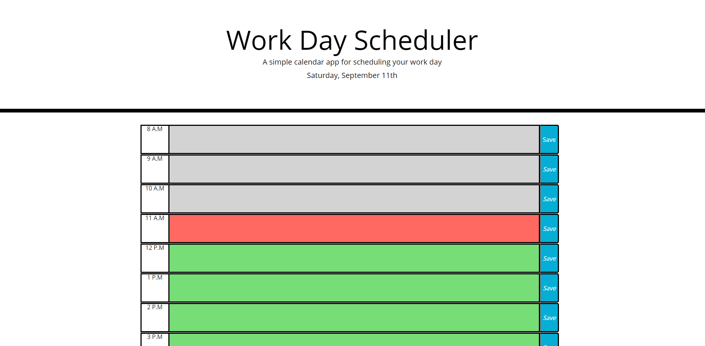

# work-day-scheduler
This website is a simple calender app for scheduling a user's work day.  The site displays the current day of the week, the name of the current month, and the current date at the top of the site.  The user is presented with a list of rows that contain an element representing the hour, a text field to enter notes or events for that hour, and a save button.  When a user enters text and clicks on the save button corresponding to that hour the text input is saved to local storage.  When the page is reloaded any text saved to local storage is displayed in the text field for the correct hour.

## Deployed Link
https://mrlowther.github.io/work-day-scheduler/

## Screenshot
